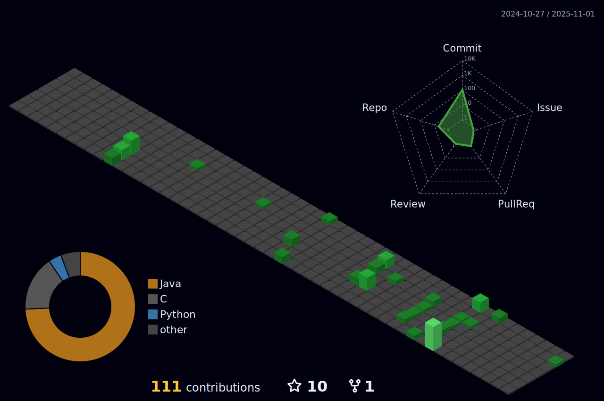

## Sobre mim
- 🧒🏻 Olá, sou Marcos Camargo
- 👀 Atualmente, trabalho como Desenvolvedor Java.
- 🎓 Bacharelado em Ciência da Computação na Universidade Estadual Paulista 'Júlio de Mesquita Filho' (UNESP)
- 🎓 Mestrado em Ciência da Computação na Universidade Estadual Paulista 'Júlio de Mesquita Filho' (UNESP) 
- 📖 Participação em artigos:
  - [<i> RA4Self-CPS: A Reference Architecture for Self-adaptive Cyber-Physical Systems</i>](https://ieeexplore.ieee.org/document/10412036)  
  - [<i> A Intrusion Detection System for Web-Based Attacks Using IBM Watson</i>](https://ieeexplore.ieee.org/document/9661457)
  - [<i> A Self-protecting Approach for Service-oriented Mobile Applications</i>](https://www.researchgate.net/publication/351352704_A_Self-protecting_Approach_for_Service-oriented_Mobile_Applications)

  
## Contatos
  

  <a href="mailto:mp.camargo@outlook.com"> 
  <a href="https://linkedin.com/in/mpcamargo1"> 

## Linguagens

    
## Linguagens e Ferramentas
  

    
    
    
    
    
    
    
    
    
  

## Perfil  
 

    
<!---
mpcamargo1/mpcamargo1 is a ✨ special ✨ repository because its `README.md` (this file) appears on your GitHub profile.
You can click the Preview link to take a look at your changes.
--->
